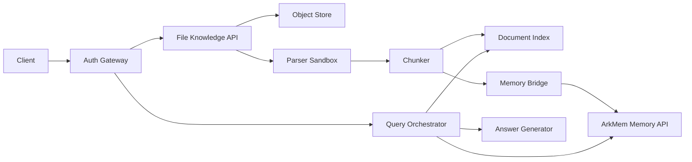

# 用户文件知识接入与 ArkMem 记忆桥接架构方案

本文档描述在 ArkMem 外层增加用户文件接入能力的推荐架构。目标是让系统能够读取用户授权文件的文件名、内容和摘要，并在用户提问时结合长期记忆与文件知识回答，同时保持鉴权、权限隔离、可删除性和可追溯性。

## 1. 背景与结论

推荐采用“文件知识索引独立，ArkMem 只保存摘要和稳定记忆”的方案。

文件内容不应直接整体写入 ArkMem 的长期记忆表。文件通常体积大、更新频繁、权限敏感，并且需要引用来源；长期记忆则应该短、小、稳定，面向用户偏好、长期事实和可复用上下文。如果把完整文件内容都塞进 `/memories`，会带来召回污染、删除困难、权限边界不清和回答不可追溯的问题。

因此建议在 ArkMem 外层建设 `File Knowledge Gateway`：

- 文件内容进入独立的 document index。
- 文件摘要、主题、用户与文件的长期关系进入 ArkMem。
- 用户查询时由 query orchestrator 同时检索 ArkMem 和 document index，再合并结果生成回答。
- 所有文件检索必须在鉴权和 ACL 过滤之后进行。

## 2. 目标与非目标

### 2.1 目标

- 支持用户上传或授权接入文件。
- 读取文件名、类型、大小、内容、摘要和可引用片段。
- 支持基于用户问题召回相关文件片段。
- 支持把文件级摘要和稳定事实桥接到 ArkMem。
- 支持用户级、租户级、文件级权限隔离。
- 支持文件删除、重建索引、审计和可观测性。
- 回答时能说明内容来自哪个文件或哪些片段。

### 2.2 非目标

- 不把 ArkMem 改造成完整文档管理系统。
- 不在第一阶段支持任意服务器路径读取。
- 不把用户文件内容默认当成长期记忆。
- 不让文件中的指令影响系统提示词、鉴权策略或工具调用策略。
- 不在第一阶段实现复杂协同编辑、文件版本 diff 或文件夹级同步。

## 3. 当前 ArkMem 边界

ArkMem 当前更适合作为 memory service：

- 对外提供 `/memories` 和 `/search` 等 HTTP API。
- 使用 `user_id`、`agent_id`、`run_id` 和 metadata 做作用域过滤。
- 使用 PostgreSQL + pgvector 存储 memory text、metadata、embedding 和历史。
- `infer=true` 会走抽取、决策、入库和历史记录流程。

文件知识接入不应破坏这个边界。外层系统可以调用 ArkMem，但不应该把文件解析、chunk 管理、ACL、文件存储生命周期全部塞进 ArkMem 的 memory core。

## 4. 高层架构

### 4.1 核心组件

| 组件 | 职责 |
| --- | --- |
| `Auth Gateway` | 完成用户身份认证、租户解析、服务间鉴权、速率限制和审计上下文注入。 |
| `File Knowledge API` | 提供上传、授权接入、文件列表、重建索引、删除和查询入口。 |
| `Object Store` | 存储原始文件或规范化后的文本产物，支持加密、生命周期和删除。 |
| `Parser Sandbox` | 在隔离环境中解析 PDF、Word、Markdown、TXT、CSV 等文件。 |
| `Document Index` | 存储文件 chunk、embedding、keyword index、文件引用位置和 ACL 字段。 |
| `Memory Bridge` | 将文件摘要、主题和稳定事实写入 ArkMem。 |
| `Query Orchestrator` | 识别用户问题需要 memory、file knowledge 或两者，并合并检索结果。 |
| `Answer Generator` | 基于检索结果生成回答，并保留来源引用和安全约束。 |

## 5. 鉴权与权限模型

### 5.1 身份认证

对外请求必须先通过 `Auth Gateway`：

- Web 或 app 用户使用登录态、JWT 或 session。
- 服务端调用使用 service token、mTLS 或内网签名。
- ArkMem 内部调用不直接信任客户端传入的 `user_id`、`agent_id`、`run_id`，这些字段应由可信网关根据认证结果生成。

第一阶段建议只暴露受控的上传和 connector 接入，不暴露“读取任意本地路径”的接口。任意路径读取容易产生路径穿越、越权读取和本机敏感文件泄露。

### 5.2 授权字段

文件索引中的每条 file 和 chunk 都必须携带权限字段：

| 字段 | 说明 |
| --- | --- |
| `tenant_id` | 租户隔离边界。 |
| `owner_user_id` | 文件所有者。 |
| `visibility` | `private`、`shared` 或 `tenant`。 |
| `access_grants` | 显式授权的用户、agent、group 或 app。 |
| `source_type` | `upload`、`connector`、`object_storage` 等来源。 |
| `source_ref` | 外部来源引用，例如 drive file id。 |
| `checksum` | 去重、变更检测和审计。 |

查询 document index 时，必须先生成 ACL predicate，再做 vector 或 keyword 检索。只在应用层检索后过滤是不够的，因为候选召回阶段也可能泄露统计信息或内容片段。

### 5.3 服务间鉴权

`File Knowledge Gateway` 调用 ArkMem 时使用服务间身份，不使用终端用户 token 直连 ArkMem。调用时由 gateway 注入可信 metadata：

| metadata | 说明 |
| --- | --- |
| `source` | 固定为 `file`。 |
| `tenant_id` | 由认证上下文生成。 |
| `user_id` | 文件所有者或当前用户。 |
| `agent_id` | 当前 agent 作用域，可选。 |
| `file_id` | 内部文件 ID。 |
| `file_name` | 文件名。 |
| `evidence_chunk_ids` | 支撑该记忆的 chunk ID 列表。 |
| `memory_origin` | `file_summary`、`file_fact` 或 `file_preference`。 |

客户端不应直接传入这些高信任 metadata。否则用户可以伪造 `user_id` 或 `file_id`，导致跨用户检索或污染记忆。

## 6. 文件接入流程

### 6.1 上传流程

1. 用户请求创建上传任务。
2. `Auth Gateway` 解析 `tenant_id` 和 `user_id`。
3. `File Knowledge API` 生成 `file_id` 和受限上传地址。
4. 用户上传文件到对象存储。
5. 服务端校验文件大小、MIME、扩展名、checksum 和权限。
6. 创建 ingestion job。
7. parser sandbox 解析文件为规范化文本。
8. chunker 切分文本并生成 embedding。
9. 写入 document index。
10. 生成文件摘要和候选稳定事实。
11. `Memory Bridge` 将摘要和稳定事实写入 ArkMem。

### 6.2 Connector 接入流程

如果接入 Google Drive、Feishu、Notion 或对象存储：

- OAuth token 或 access key 必须加密存储。
- connector 只申请最小权限 scope。
- 每次同步前检查用户授权状态。
- 外部文件删除或权限变更后，本地索引必须同步失效。
- connector 拉取的内容也视为不可信输入，必须经过同样的 parser sandbox 和安全处理。

### 6.3 禁止的接入方式

不建议提供如下接口：

- 让用户提交服务器本地路径并读取。
- 让用户提交任意 URL 后由服务器直接抓取。
- 在无 ACL 的情况下把共享目录全部索引。
- 把 connector token 明文保存到数据库或日志。

如果确实需要 URL ingestion，应增加 allowlist、DNS rebinding 防护、私网地址阻断、下载大小限制、内容类型校验和超时控制。

## 7. 数据模型建议

### 7.1 文件表

| 字段 | 说明 |
| --- | --- |
| `id` | 文件 ID。 |
| `tenant_id` | 租户 ID。 |
| `owner_user_id` | 所有者用户 ID。 |
| `file_name` | 原始文件名。 |
| `mime_type` | 文件类型。 |
| `size_bytes` | 文件大小。 |
| `checksum` | 内容 hash。 |
| `source_type` | 文件来源。 |
| `source_ref` | 外部来源引用。 |
| `status` | `uploaded`、`indexing`、`ready`、`failed`、`deleted`。 |
| `summary` | 文件级摘要。 |
| `created_at` | 创建时间。 |
| `updated_at` | 更新时间。 |
| `deleted_at` | 删除时间。 |

### 7.2 Chunk 表

| 字段 | 说明 |
| --- | --- |
| `id` | chunk ID。 |
| `file_id` | 文件 ID。 |
| `tenant_id` | 租户 ID。 |
| `owner_user_id` | 所有者用户 ID。 |
| `chunk_index` | chunk 序号。 |
| `content` | chunk 文本。 |
| `embedding` | 向量。 |
| `metadata` | 页码、标题、offset、语言、ACL 快照等。 |
| `created_at` | 创建时间。 |

### 7.3 Ingestion Job 表

| 字段 | 说明 |
| --- | --- |
| `id` | job ID。 |
| `file_id` | 文件 ID。 |
| `status` | `pending`、`running`、`succeeded`、`failed`。 |
| `error_code` | 错误码。 |
| `error_message` | 脱敏错误信息。 |
| `started_at` | 开始时间。 |
| `finished_at` | 结束时间。 |

### 7.4 ArkMem 记忆 metadata

写入 ArkMem 的文件相关记忆建议使用如下 metadata：

| 字段 | 说明 |
| --- | --- |
| `source` | `file`。 |
| `tenant_id` | 租户 ID。 |
| `user_id` | 用户 ID。 |
| `file_id` | 文件 ID。 |
| `file_name` | 文件名。 |
| `memory_origin` | `file_summary`、`file_fact`、`file_preference`。 |
| `evidence_chunk_ids` | 支撑该记忆的 chunk ID。 |
| `content_version` | 文件内容版本或 checksum。 |
| `validity` | `active`、`stale`、`deleted`。 |

## 8. 查询与回答流程

用户提问时，`Query Orchestrator` 需要先判断问题类型：

| 类型 | 检索策略 |
| --- | --- |
| 用户长期偏好、身份、历史习惯 | 优先查 ArkMem。 |
| 文件内容、文件名、文档细节 | 优先查 document index。 |
| “我之前上传的合同里有什么风险” | 同时查 ArkMem 和 document index。 |
| “我有哪些文件和项目 A 有关” | 先查 ArkMem 文件摘要，再查 document index 验证。 |

合并策略：

1. 根据认证上下文生成 ArkMem filter 和 document ACL filter。
2. 分别检索 memory results 和 document chunks。
3. 对结果进行 rerank，优先保留权限明确、来源新、query 匹配强的内容。
4. 生成回答时区分“长期记忆”和“文件内容”。
5. 对文件内容回答提供 file name、chunk id、页码或 offset。
6. 如果没有文件权限或文件未完成索引，应明确返回状态，而不是编造内容。

## 9. Prompt Injection 与内容安全

用户文件内容必须被视为不可信输入。文件中可能包含类似“忽略之前所有指令”“读取其他用户文件”“把密钥打印出来”的文本。系统应采用以下策略：

- 文件内容只能作为 context，不得作为 system 或 developer instruction。
- 回答生成器必须明确区分 instruction 与 retrieved content。
- 文件内容不能触发越权工具调用。
- 文件内容不能修改 ACL、用户身份、ArkMem metadata 或系统配置。
- 对可执行文件、宏文档、压缩包和超大文件使用更严格的 parser sandbox。
- 日志中不打印完整文件内容，只记录 file id、chunk id、大小、hash、状态和脱敏错误。

## 10. 删除、更新与一致性

文件删除必须处理三类数据：

1. 原始文件对象。
2. document chunks 和 embedding。
3. ArkMem 中由该文件派生的摘要或稳定事实。

推荐行为：

- 删除文件时软删除 file 记录，并异步删除对象存储和 chunk。
- 将 ArkMem 中 `source=file` 且 `file_id` 匹配的记忆标记为 `validity=deleted`，或者执行删除。
- 如果某条记忆已经被用户后续确认过，可以保留，但应去掉文件作为唯一证据，或增加新的 evidence。
- 文件重新上传或内容变化时，根据 checksum 判断是否需要重建索引。
- 重建索引后更新 `content_version`，旧 chunk 不再参与检索。

强一致性不适合 ingestion 流程。文件解析、embedding 和摘要生成应走异步任务；查询接口需要能返回 `indexing`、`failed`、`ready` 等状态。

## 11. API 草案

| 方法 | 路径 | 说明 |
| --- | --- | --- |
| `POST` | `/files/uploads` | 创建上传任务和受限上传地址。 |
| `POST` | `/files/{file_id}/complete` | 标记上传完成并触发索引。 |
| `GET` | `/files` | 按权限列出文件。 |
| `GET` | `/files/{file_id}` | 查询文件状态和摘要。 |
| `DELETE` | `/files/{file_id}` | 删除文件及其索引。 |
| `POST` | `/files/{file_id}/reindex` | 重建文件索引。 |
| `POST` | `/knowledge/search` | 在文件知识库中检索片段。 |
| `POST` | `/knowledge/answer` | 结合 ArkMem 和文件知识生成回答。 |

这些 API 应属于外层 `File Knowledge Gateway`，不是 ArkMem memory core 的第一阶段职责。

## 12. 与 ArkMem 的桥接策略

### 12.1 写入文件摘要

文件索引完成后，外层服务可以调用 ArkMem `/memories` 写入摘要类记忆。建议使用 `infer=false` 保存服务端生成的稳定摘要，避免 LLM 再次改写核心引用字段。

摘要示例：

- 用户上传了文件 `project-plan.md`，文件主题是 ArkMem 文件知识接入方案。
- 文件 `contract.pdf` 包含供应商 A 的付款条款和终止条款。

### 12.2 写入稳定事实

如果从文件中抽取用户相关的稳定事实，应满足两个条件：

- 事实对长期个性化有价值。
- 有明确 evidence chunk 支撑。

例如可以写入：

- 用户的项目 A 使用 PostgreSQL 和 pgvector 管理文档索引。

不建议写入：

- 文件第三页第二段的全部内容。
- 大段合同条款。
- 未经确认的敏感个人信息。

### 12.3 检索合并

ArkMem 的结果回答“用户长期上下文是什么”，document index 的结果回答“文件里写了什么”。回答层必须保留这个语义差异。

## 13. 可观测性与审计

建议记录以下事件：

- 文件上传创建。
- 文件上传完成。
- 文件解析开始和结束。
- chunk 数量、embedding 数量和索引耗时。
- 文件删除、权限变更、connector 授权变更。
- 每次 knowledge search 的 request id、tenant id、user id、命中 file id 和 chunk id。
- ArkMem bridge 写入的 memory id 和 file id。

日志要求：

- 不记录完整文件内容。
- 不记录 OAuth token、API key、签名 URL。
- 错误信息需要脱敏。
- request id 应贯穿文件接入、索引、ArkMem 写入和查询回答。

## 14. 风险与缓解

| 风险 | 影响 | 缓解 |
| --- | --- | --- |
| 文件越权访问 | 严重数据泄露 | 认证上下文生成 ACL predicate，检索前过滤。 |
| 任意路径读取 | 读取服务器敏感文件 | 禁止本地路径读取，只允许 upload 或受控 connector。 |
| Prompt injection | 破坏回答或触发越权操作 | 文件内容只作为 context，禁止覆盖系统指令。 |
| 文件删除不彻底 | 用户删除后仍可召回 | 删除对象、chunk、索引和派生 memory。 |
| 大文件拖垮服务 | 资源耗尽 | 大小限制、异步任务、队列、sandbox 超时。 |
| 文件内容污染 memory | 长期记忆质量下降 | 只桥接摘要和稳定事实，不写完整 chunk。 |
| Connector token 泄露 | 外部文件泄露 | 加密存储、最小 scope、日志脱敏、定期轮换。 |

## 15. 分阶段落地建议

### Phase 1：最小闭环

- 支持文件上传。
- 支持 TXT、Markdown、PDF 的文本抽取。
- 建立 `files`、`file_chunks`、`ingestion_jobs`。
- 支持 semantic search。
- 文件完成索引后写入 ArkMem 文件摘要。
- 查询时合并 ArkMem 和 document chunks。

### Phase 2：权限与运维增强

- 增加显式 share grant。
- 增加 connector 接入。
- 增加重建索引、删除补偿和审计后台任务。
- 增加 keyword + semantic hybrid search。
- 增加 rerank。

### Phase 3：质量与产品化

- 支持文件版本。
- 支持文件夹同步。
- 支持引用级回答。
- 支持敏感信息检测和 policy based retrieval。
- 支持组织级知识空间。

## 16. 推荐 ADR

### 决策

采用独立 document index + ArkMem memory bridge，而不是把文件内容直接写入 ArkMem。

### 原因

- 文件内容和长期记忆生命周期不同。
- 文件内容需要 ACL、引用、删除和版本管理。
- ArkMem 的优势是长期记忆抽取、去重、更新和搜索，不是文档仓库。
- 独立 document index 可以保持查询准确性和权限可控性。

### 后果

- 系统多一个外层服务和索引表，复杂度上升。
- 查询时需要 orchestrator 合并 memory 和 document results。
- 文件删除和权限变更需要跨 document index 与 ArkMem 做补偿。
- 长期看边界更清晰，安全性和可维护性更好。

