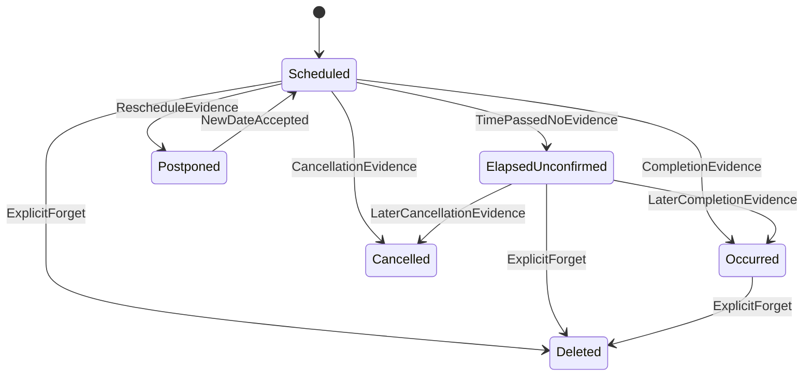
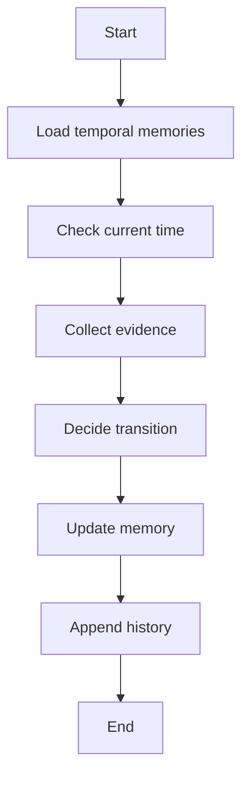

# 时间型记忆生命周期与更新架构方案

本文档描述 ArkMem 中“带时间约束的记忆”的建模、降权、状态迁移和改写方案。典型场景是：用户在 2026-06-03 说“我今天要开会”，到 2026-06-04 后，这条记忆不应继续作为未来计划高权重召回；但也不能在没有证据的情况下自动改写为“用户在 2026-06-03 开了会议”。

## 1. 直接结论

推荐采用 `temporal memory lifecycle` 方案：

- 写入时把“计划、截止日期、预约、提醒、临时安排”等识别为时间型记忆，并写入标准 metadata。
- 检索时根据当前时间、记忆状态和用户问题意图计算 `temporal_weight`，对过期计划降权。
- 通过定时任务或写入后触发的维护流程，把过期计划迁移到 `elapsed_unconfirmed`。
- 只有存在明确证据时，才能把 `scheduled` 或 `elapsed_unconfirmed` 改写为 `occurred`。
- 所有自动更新都走现有 UPDATE/history 语义，保留旧文本、更新时间和证据来源。

核心约束：**日期已过只代表计划过期，不代表事件已发生**。

## 2. 背景与当前边界

ArkMem 当前已经具备适合承载该方案的基础能力：

- `arkmem_memories.metadata` 是 JSONB，可先承载时间字段，不需要第一阶段改表。
- `MemoryService.update` 会更新正文、metadata、embedding，并写入 history。
- 当前 prompt 已经注入当前日期，并支持 ADD、UPDATE、DELETE、NONE 决策。
- 当前搜索包括 semantic、keyword 和 hybrid，但没有时间衰减分数。

因此第一阶段建议优先基于 metadata 和服务层策略实现，不急于引入独立 temporal 表。等时间型记忆规模、查询模式和维护复杂度明确后，再考虑把关键字段提升为一等列。

## 3. 设计目标与非目标

### 3.1 目标

- 支持未来计划在过期后自动降权。
- 支持在无证据时把过期计划标记为“已过期但未确认”。
- 支持在有证据时把计划改写为“已发生、已取消、已延期”。
- 保留历史记录，便于审计自动更新原因。
- 检索时区分“未来安排”“历史事件”“未确认过期计划”。
- 尽量复用现有 ArkMem memory API 和 metadata filter。

### 3.2 非目标

- 不在无证据情况下推断事件已经发生。
- 不把所有带日期文本都强制改写成结构化事件。
- 不在第一阶段实现完整日历系统。
- 不让 LLM 单独决定高风险状态迁移。
- 不删除过期计划，除非用户明确要求或策略明确允许。

## 4. 时间型记忆分类

| 类型 | 示例 | 初始状态 | 默认过期行为 |
| --- | --- | --- | --- |
| `scheduled_event` | 用户 2026-06-03 要开会。 | `scheduled` | 到期后转为 `elapsed_unconfirmed` 并降权。 |
| `deadline` | 用户需要在 2026-06-10 前提交报告。 | `scheduled` | 到期后转为 `elapsed_unconfirmed` 或 `missed_unconfirmed`。 |
| `reminder` | 明天提醒用户发邮件。 | `scheduled` | 触发后转为 `completed` 或 `elapsed_unconfirmed`。 |
| `temporary_preference` | 用户今天只想讨论方案。 | `active` | 到期后转为 `expired`。 |
| `historical_event` | 用户 2026-06-03 开了会议。 | `occurred` | 不降权为未来计划，可作为历史事实召回。 |

第一阶段优先支持 `scheduled_event`、`deadline`、`historical_event` 三类即可。

## 5. 状态机



### 5.1 状态定义

| 状态 | 含义 | 是否高权重参与未来计划召回 |
| --- | --- | --- |
| `scheduled` | 未来计划仍可能发生。 | 是。 |
| `elapsed_unconfirmed` | 日期已过，但没有证据证明发生、取消或延期。 | 否。 |
| `occurred` | 有证据证明事件发生。 | 否，但可高权重参与历史查询。 |
| `cancelled` | 有证据证明事件取消。 | 否。 |
| `postponed` | 有证据证明事件延期。 | 否，新日期应写入新状态或新记忆。 |
| `expired` | 临时偏好或短期上下文过期。 | 否。 |
| `deleted` | 用户要求忘记或策略删除。 | 否。 |

## 6. Metadata 规范

时间型记忆建议使用如下 metadata：

| 字段 | 类型 | 说明 |
| --- | --- | --- |
| `memory_type` | string | 固定为 `temporal_memory`。 |
| `temporal_kind` | string | `scheduled_event`、`deadline`、`reminder`、`temporary_preference`、`historical_event`。 |
| `event_status` | string | `scheduled`、`elapsed_unconfirmed`、`occurred`、`cancelled`、`postponed`、`expired`。 |
| `event_date` | string | 事件日期，使用 ISO-8601 local date。 |
| `event_time` | string | 可选，事件时间。 |
| `event_timezone` | string | 时区，例如 `Asia/Shanghai`。 |
| `valid_from` | string | 记忆开始生效时间。 |
| `valid_until` | string | 计划或临时事实的有效截止时间。 |
| `evidence_type` | string | `user_statement`、`calendar_status`、`file_evidence`、`assistant_observation`。 |
| `evidence_ref` | string | 外部证据引用，例如 message id、calendar event id、file id。 |
| `confidence` | number | 状态置信度。 |
| `last_temporal_check_at` | string | 最近一次生命周期检查时间。 |
| `temporal_policy_version` | string | 策略版本。 |

示例：

```json
{
  "memory_type": "temporal_memory",
  "temporal_kind": "scheduled_event",
  "event_status": "scheduled",
  "event_date": "2026-06-03",
  "event_timezone": "Asia/Shanghai",
  "valid_from": "2026-06-03T00:00:00+08:00",
  "valid_until": "2026-06-04T00:00:00+08:00",
  "evidence_type": "user_statement",
  "evidence_ref": "message:123",
  "confidence": 0.8,
  "temporal_policy_version": "v1"
}
```

## 7. 写入流程

当用户输入包含时间表达时，写入流程分为四步：

1. 解析当前时间和用户时区。
2. 从消息中抽取候选事实。
3. 对候选事实做时间归一化。
4. 写入正文和 temporal metadata。

示例输入：用户在 2026-06-03 说“我今天要开会”。

建议写入正文：

```json
{
  "text": "User plans to have a meeting on 2026-06-03.",
  "metadata": {
    "memory_type": "temporal_memory",
    "temporal_kind": "scheduled_event",
    "event_status": "scheduled",
    "event_date": "2026-06-03",
    "event_timezone": "Asia/Shanghai",
    "valid_until": "2026-06-04T00:00:00+08:00",
    "evidence_type": "user_statement",
    "confidence": 0.8
  }
}
```

写入正文需要避免中文相对时间残留，例如“今天”“明天”“下周三”。正文可以保留用户语言，但日期必须归一化到明确日期，metadata 必须保存标准时间字段。

## 8. 检索降权策略

检索层增加 `temporal_weight`，最终分数可以按如下方式计算：

```text
final_score = base_score * temporal_weight * intent_weight
```

其中 `base_score` 是现有 semantic、keyword 或 hybrid 分数。

### 8.1 默认权重

| 条件 | `temporal_weight` |
| --- | --- |
| 非时间型记忆 | `1.0` |
| `scheduled` 且未过期 | `1.0` |
| `scheduled` 且已过期 | `0.2` |
| `elapsed_unconfirmed` | `0.15` |
| `occurred` | `0.7` |
| `cancelled` | `0.3` |
| `expired` | `0.1` |

### 8.2 查询意图权重

| 用户问题 | 处理方式 |
| --- | --- |
| “我接下来有什么安排？” | 降低过期计划和历史事件。 |
| “我 6 月 3 日有什么事？” | 提升 `scheduled`、`elapsed_unconfirmed`、`occurred`。 |
| “我之前开过什么会？” | 提升 `occurred`。 |
| “我有哪些没确认的历史安排？” | 提升 `elapsed_unconfirmed`。 |

第一阶段可以在应用层重排候选结果，不必立刻改 SQL 排序。等数据量变大后，再把 `event_status`、`valid_until` 提升为可索引列或 generated column。

## 9. 生命周期维护流程

`TemporalMemoryMaintenanceJob` 负责周期性扫描时间型记忆，并生成状态迁移。



### 9.1 扫描范围

第一阶段扫描条件：

- `metadata.memory_type = temporal_memory`
- `metadata.event_status = scheduled`
- `metadata.valid_until < now`
- `deleted_at is null`

如果当前只使用 JSONB metadata，可用 metadata filter 查询后在服务层判断；规模变大后建议增加索引或单独字段。

### 9.2 状态迁移规则

| 当前状态 | 条件 | 动作 |
| --- | --- | --- |
| `scheduled` | 已过期且无证据 | UPDATE 为 `elapsed_unconfirmed`。 |
| `scheduled` | 有完成证据 | UPDATE 为 `occurred`。 |
| `scheduled` | 有取消证据 | UPDATE 为 `cancelled`。 |
| `scheduled` | 有延期证据 | UPDATE 为 `postponed`，并创建或更新新日期记忆。 |
| `elapsed_unconfirmed` | 后续确认已发生 | UPDATE 为 `occurred`。 |
| `elapsed_unconfirmed` | 后续确认取消 | UPDATE 为 `cancelled`。 |

### 9.3 无证据改写正文

当没有发生证据时，不应改成“开了会议”。建议改成：

```json
{
  "text": "User had planned to have a meeting on 2026-06-03.",
  "metadata": {
    "event_status": "elapsed_unconfirmed",
    "confidence": 0.5
  }
}
```

### 9.4 有证据改写正文

当存在完成证据时，才改成：

```json
{
  "text": "User had a meeting on 2026-06-03.",
  "metadata": {
    "event_status": "occurred",
    "evidence_type": "user_statement",
    "evidence_ref": "message:456",
    "confidence": 0.95
  }
}
```

## 10. 证据来源与可信度

| 证据来源 | 示例 | 是否可自动转为 `occurred` |
| --- | --- | --- |
| 用户明确确认 | “昨天会议开完了。” | 是。 |
| 日历事件状态 | 外部日历显示 completed。 | 是，但需 connector 授权。 |
| 会议纪要文件 | 用户上传会议纪要。 | 可作为强证据。 |
| 单纯日期已过 | 当前日期是 2026-06-04。 | 否。 |
| 助手猜测 | “应该已经开完了。” | 否。 |

自动迁移策略必须保守。`occurred`、`cancelled`、`postponed` 都需要新证据；只有 `elapsed_unconfirmed` 可以仅依赖时间推进。

## 11. Prompt 调整建议

### 11.1 抽取 prompt

抽取 prompt 需要增加要求：

- 识别计划、截止日期、提醒、历史事件。
- 将相对日期归一化为绝对日期。
- 输出 temporal metadata。
- 不确定具体日期时，不要编造日期。

### 11.2 决策 prompt

决策 prompt 需要增加硬规则：

- 日期已过不等于事件发生。
- 没有完成证据时，过期计划只能变为 `elapsed_unconfirmed`。
- 有明确完成证据时，才能变为 `occurred`。
- 有明确取消或延期证据时，分别变为 `cancelled` 或 `postponed`。
- 保留已有 memory id，优先 UPDATE 而不是 ADD。

### 11.3 维护任务 prompt

如果维护任务需要 LLM 辅助判断证据，只把候选记忆和有限证据传入，不要让 LLM 自行读取全库或发起外部请求。LLM 输出只作为建议，服务层再执行确定性校验。

## 12. API 草案

第一阶段可以不新增公开 API，仅通过内部 job 更新 memory。若需要外部可控能力，可增加如下内部接口：

| 方法 | 路径 | 说明 |
| --- | --- | --- |
| `POST` | `/internal/temporal-memories/scan` | 触发时间型记忆扫描。 |
| `POST` | `/internal/temporal-memories/{memory_id}/transition` | 手动迁移某条记忆状态。 |
| `GET` | `/internal/temporal-memories/due` | 查询待检查的时间型记忆。 |

请求示例：

```json
{
  "now": "2026-06-04T09:00:00+08:00",
  "tenant_id": "tenant-1",
  "user_id": "user-1",
  "dry_run": true
}
```

## 13. 数据库演进策略

### 13.1 Phase 1：只用 metadata

优点：

- 不需要改 schema。
- 与现有 JSONB metadata filter 兼容。
- 可以快速验证 prompt、状态机和降权策略。

缺点：

- 扫描和排序性能受限。
- SQL 中直接计算时间权重较麻烦。

### 13.2 Phase 2：增加索引或 generated column

当时间型记忆数量变大，可以考虑：

- 为 `metadata ->> 'event_status'` 建表达式索引。
- 为 `metadata ->> 'valid_until'` 建表达式索引。
- 将 `valid_until`、`event_status` 提升为一等列。

### 13.3 Phase 3：独立 temporal 表

当时间型记忆需要复杂查询、日历同步和批量维护时，可以引入 `arkmem_temporal_memory_states`：

| 字段 | 说明 |
| --- | --- |
| `memory_id` | 关联 memory。 |
| `temporal_kind` | 时间类型。 |
| `event_status` | 当前状态。 |
| `event_time_start` | 开始时间。 |
| `event_time_end` | 结束时间。 |
| `valid_until` | 有效期。 |
| `evidence_ref` | 证据引用。 |
| `last_checked_at` | 最近检查时间。 |

第一阶段不建议直接上独立表，避免过早扩大边界。

## 14. 错误处理与审计

维护任务必须记录：

- 扫描开始和结束时间。
- 检查了多少条记忆。
- 迁移了多少条记忆。
- 每条迁移的旧状态、新状态、原因和证据。
- dry run 结果。
- 失败 memory id 和错误码。

所有自动迁移都应追加 history。对于自动把正文改成历史事实的行为，必须记录 evidence，否则后续无法解释为什么系统认为事件已发生。

## 15. 测试策略

### 15.1 单元测试

- 相对日期归一化。
- `valid_until` 计算。
- 状态迁移规则。
- temporal weight 计算。
- 查询意图对权重的影响。

### 15.2 服务测试

- 写入 “User plans to have a meeting on 2026-06-03.” 后，metadata 正确。
- 到 2026-06-04 无证据时，状态变为 `elapsed_unconfirmed`。
- 到 2026-06-04 有完成证据时，状态变为 `occurred`。
- 搜索“next schedule”时过期计划降权。
- 搜索“June 3 meeting”时过期计划仍可召回。

### 15.3 回归测试

- 非时间型偏好不受降权影响。
- 用户明确要求删除时仍走 DELETE。
- UPDATE 后 history 中保留 old memory 和 new memory。
- 不同 `user_id` 的时间型记忆不会互相扫描或更新。

## 16. 风险与缓解

| 风险 | 影响 | 缓解 |
| --- | --- | --- |
| 自动编造已发生事件 | 破坏用户信任 | 无证据只能转为 `elapsed_unconfirmed`。 |
| 过期计划完全消失 | 历史查询无法回答 | 降权而不是删除。 |
| JSONB 扫描慢 | 维护任务性能下降 | Phase 2 增加表达式索引或一等列。 |
| 时区错误 | 日期状态迁移错误 | metadata 必须保存 `event_timezone`。 |
| LLM 误判状态 | 错误 UPDATE | 服务层使用确定性状态机校验。 |
| 反复迁移 | history 噪声 | 使用 `last_temporal_check_at` 和幂等 transition key。 |

## 17. 分阶段落地建议

### Phase 1：最小可用

- 定义 temporal metadata。
- 修改抽取和决策 prompt。
- 增加服务层 temporal weight。
- 增加维护任务，把过期 `scheduled` 改为 `elapsed_unconfirmed`。
- 所有状态更新走现有 `MemoryService.update`。

### Phase 2：增强证据驱动更新

- 接入用户后续消息作为证据。
- 接入文件知识或日历 connector 作为证据。
- 增加手动 transition 内部接口。
- 增加 dry run 和审计日志。

### Phase 3：性能与产品化

- 增加 temporal 字段索引。
- 引入独立 temporal state 表。
- 增加面向用户的“待确认历史安排”能力。
- 增加更精细的 query intent classifier 和 reranker。

## 18. 推荐 ADR

### 决策

采用 metadata-first 的时间型记忆生命周期方案。第一阶段通过 `metadata`、search rerank 和维护任务实现降权与状态迁移；暂不新增独立 temporal 表。

### 原因

- 当前 ArkMem 已有 JSONB metadata、UPDATE 和 history 能力。
- 时间型记忆的语义风险主要在状态判断，不在存储结构。
- metadata-first 能快速验证策略，避免过早设计复杂 schema。
- 降权与改写是两个不同动作，必须分开控制。

### 后果

- 第一阶段扫描性能有限。
- temporal weight 可能先在应用层计算。
- 后续如果时间型记忆规模变大，需要索引或 schema 演进。
- 状态迁移更加保守，但可以避免无证据编造历史事实。

